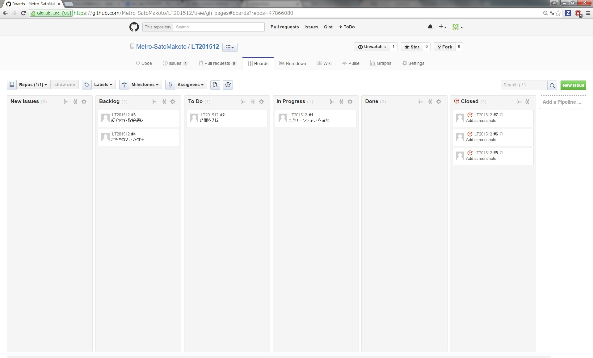

# GitHubを使おう

<!-- -->  
BS企業  
LT201512  
佐藤誠  

# GitHubを使わざればプログラマーに非ず！

# GitHubとは

# こんなサービス

Gitホスティングサービス  
<!-- -->  
特徴的なのは・・・  

## PullRequest  
<!--
    ご存知 'プルリク', 'プルリ', 'PR'  
    GitにはPullRequest機能なし。  
    サードパーティーが"clone->開発->オリジナル開発者に取り込み依頼"することを機能として表現したもの。  
    オープンソース開発のスタンダードになった偉大な機能。  
-->

## Forkの概念  
<!--
    Git本体には、リポジトリーをどこから持ってきたのかを管理する機能なし。  
    GitHubでは独自にオリジナルリポジトリーを管理している。  
-->

## markdown  
<!--
    ドキュメント類は全部markdownで。  
    GitHub上ではHTMLにレンダリングして表示される。  
    テキストなのでgitでなくてもvcsと相性よし。  
    リアルタイムレンダリングできるエディター多数(例:atom)  
-->

## お値段無料  
<!--
    ・・・オープンソース(Public repository)なら。  
    Private repositoryは有料なり。  
-->

# こんなに便利

## issue管理  
<!--
    開発項目、バグを管理できる。  
    規模にもよるが多人数での開発でなければチケット/イシュー/バグトラッキングシステムは不要。  
-->

## Github pages  
<!--
    プロジェクトを他者に説明するページ。  
    Gitリポジトリーの1ブランチ。ブランチ名を"gh-pages"にするだけ。  
    デモページ作れるし、そのままプレゼン風にもできる。(まさしく今見ているこのLTのことだ！)
-->

## gist  
<!--
    コードスニペットを管理できる。  
    これ自身もGitリポジトリー。  
-->

## wiki  
<!--
    ふつーにWiki。  
    これ自身もGitリポジトリー。  
    表現もmarkdownでおkなので、手元のエディターで書いてgit pushができる。便利！  
-->

# 広大なエコシステム

## OAuth  
<!--
    Githubアカウントでログインできるサービス多数  
-->

## reveal.js  
<!--
    Github pagesをパワポ代わりに！  
    これもmarkdownなので手元のエディターでおk。  
-->

## zenhub
  
<!--
-->

## travis ci  
<!--
-->

## slack  
<!--
-->

## koding  
<!--
-->

これらはほんの一例です。

# だからみんなGitHubを使おう

さあ、 Let's social coding!  

<!--
こんなに便利なサービスを使わないんですか？  
プログラマーなら楽をしましょう。  
便利な道具を無視してわざわざ苦労を背負い込むなんてプログラマーじゃないですよ！  
-->

<!-- -->  
<!-- -->  
## といいつつ、実は・・・

残酷なことに、   
**GitHubのアカウントはプログラマーの履歴書になってしまう** 
のです・・・。  
<!-- -->  
GitHubにアカウントを持っていないプログラマーなんて、そんなプログラマーはいないんです・・・。  
これからいっぱい使って立派なプログラマーになるんだ・・・ (´・ω・`)

# 俺たちの戦いはこれからだ！  

