# GitHubを使おう

<!-- -->  
BS企業  
LT201512  
佐藤誠  

# GitHubを使わざればプログラマーに非ず！

# GitHubとは

# こんなサービス

Gitホスティングサービス  
<!-- -->  
特徴的なのは・・・  

## PullRequest  
<!--
    ご存知 'プルリク', 'プルリ', 'PR'  
    GitにはPullRequest機能なし。  
    サードパーティーが"clone->開発->オリジナル開発者に取り込み依頼"することを機能として表現したもの。  
    オープンソース開発のスタンダードになった偉大な機能。  
    このスクリーンショットではサードパーティーではなく自分自身だけど。
-->
  

これを  

  

こうして  

  

マージすると  

  

取り込まれる      

## Fork  
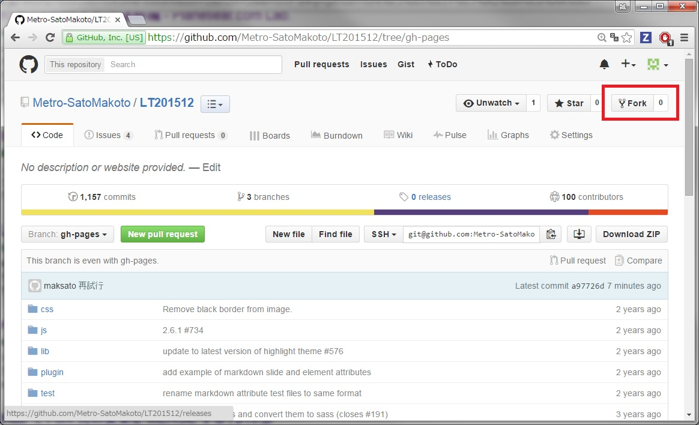  
<!--
    Git本体には、リポジトリーをどこから持ってきたのかを管理する機能なし。  
    GitHubでは独自にオリジナルリポジトリーを管理している。  
    ちなみに貢献する気がなければFork機能は使わないのがふつう。  
    サードパーティがPullRequestするときに必要。  
    人気のバロメーターの一つ。  
-->

## markdown  
<!--
    ドキュメント類は全部markdownで。  
    GitHub上ではHTMLにレンダリングして表示される。  
    テキストなのでgitでなくてもvcsと相性よし。  
    リアルタイムレンダリングできるエディター多数(例:atom)  
-->

  

これは実は・・・

こう書かれている。  

Visual Studio Codeでレンダリングしつつ書く。
  

## お値段無料  

<!--
    ・・・オープンソース(Public repository)なら。  
    Private repositoryは有料なり。  
-->

# こんなに便利

## issue管理  
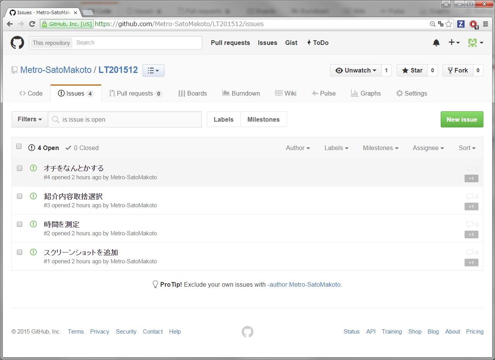
<!--
    開発項目、バグを管理できる。  
    規模にもよるが多人数での開発でなければチケット/イシュー/バグトラッキングシステムは不要。  
-->

## Github pages  
<!--
    プロジェクトを他者に説明するページ。  
    Gitリポジトリーの1ブランチ。ブランチ名を"gh-pages"にするだけ。  
    Webサーバーが稼働していて、htmlをレンダリングして表示できる。
    アプリケーションサーバー的な使い方はできないが、Javascriptも動くので動きのあるページは作れる。  
    デモページが王道らしい。  
-->

gh-pagesブランチの  

index.htmlを表示しているだけ。  

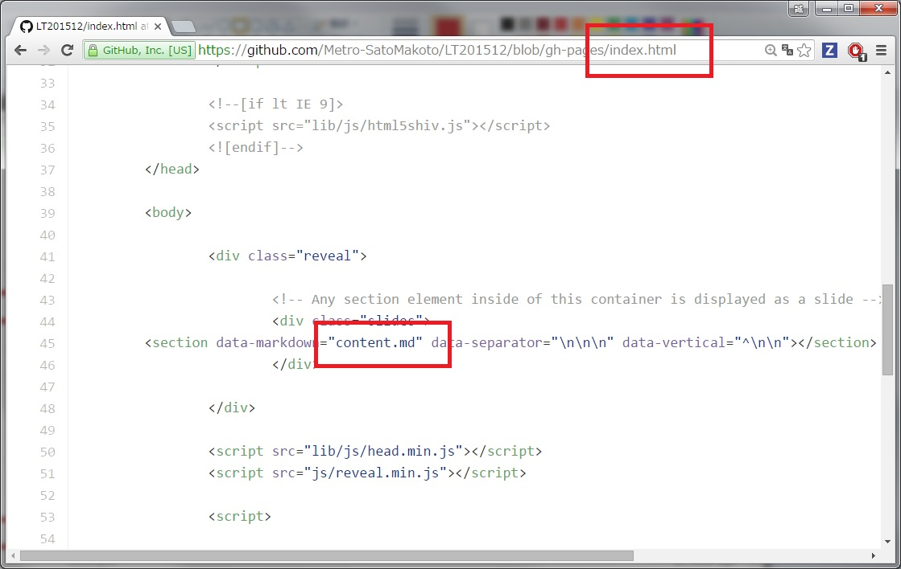

内容はcontent.mdに外出している。  

## gist  
<!--
    コードスニペットを管理できる。  
    これ自身もGitリポジトリー。  
    ブログ埋め込みできる。  
    対応している言語の拡張子であれば、それっぽくシンタックスハイライティングしてくれる。  
    スニペットなので一部だけでOK.
-->
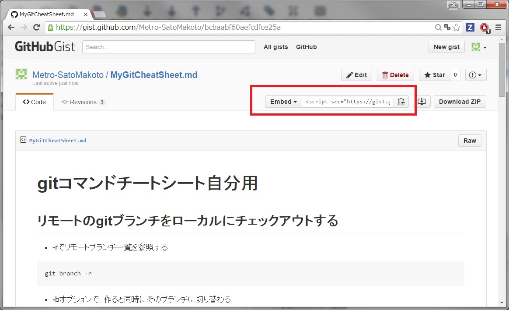

ブログ埋め込みに使うタグ  

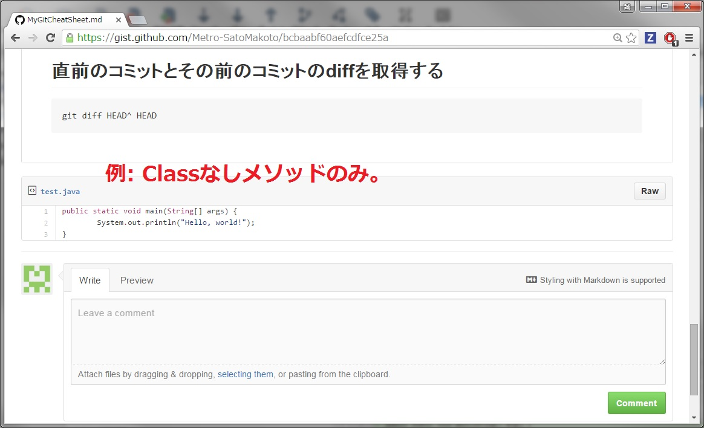

コードは適当です  

# 広大なエコシステム

## OAuth
<!--
    Githubアカウントでログインできるサービス多数  
-->

## reveal.js  
<!--
    Github pagesをパワポ代わりに！  
    markdownなので手元のエディターで書きつつスライド作成可能。  
    Windowsだと面倒なのでMac欲しいです。  
-->
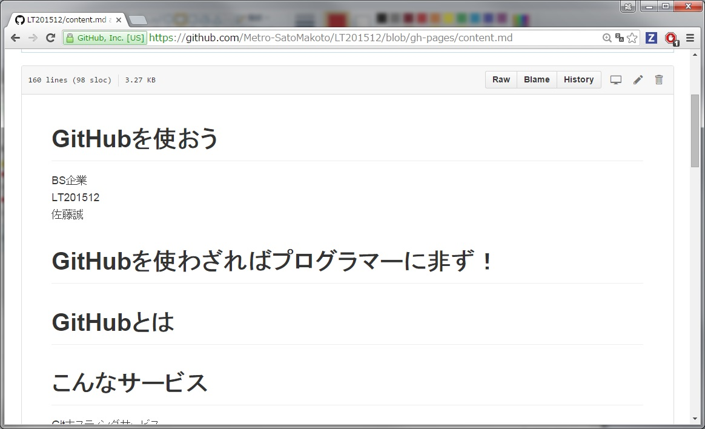   

これが原稿で・・・  

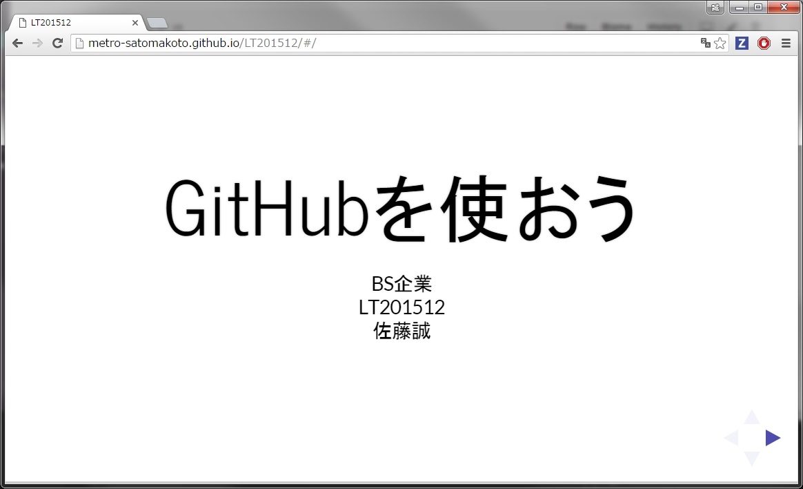

こう見せてくれる。  
今見てますね。  

## ZenHub
<!--
    issueをカンバン風に表示してくれるChromeアプリ。  
-->

  

これを・・・  

  

こう整理できる。  

## Travis CI  
<!--
    Githubでは定番のCIツール。  
    みんなREADME.mdにバッジを貼ってる。  
    いまどきっぽい感じですね。  
-->
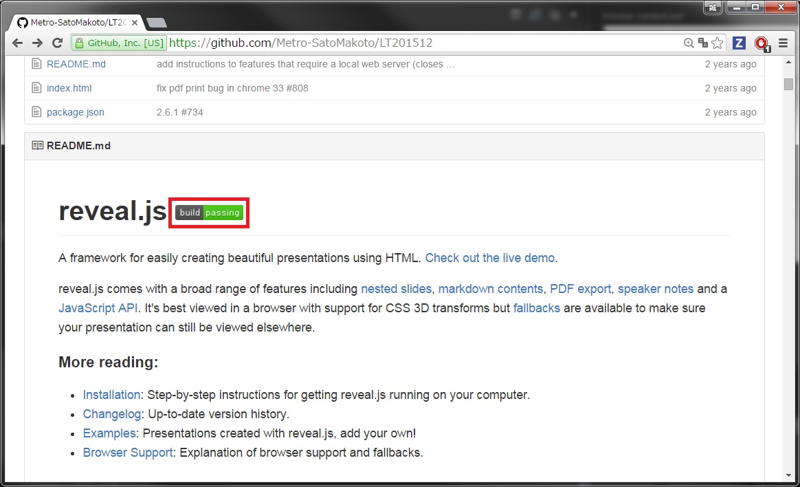  

このバッジは  

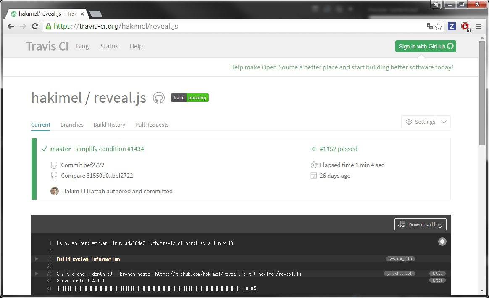  

Travis CIのビルド通過のバッジ。  

## Slack  
<!--
    チャットアプリ。  
    SlackはGithubの周辺サービスというわけではなく、それ自身がハブになっている。  
    ここではgithubにcommitをpushすると自動的にSlackにコミットログが流れるようにしている。  
    自分でリポジトリを持ち、PullRequestを活用するようになるとありがたくなるかと。  
-->
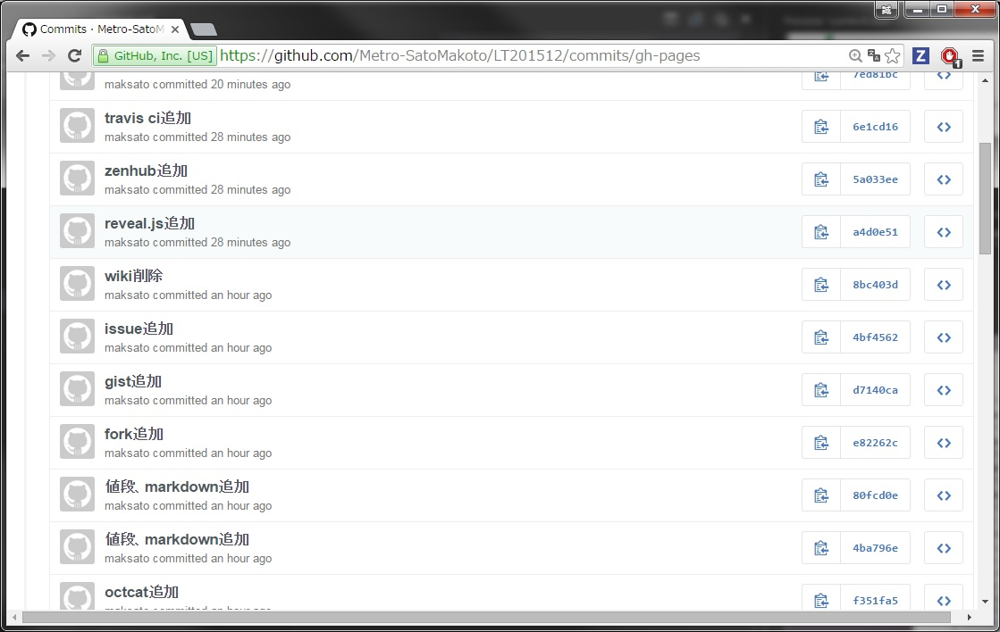

commitをpushすると  

  
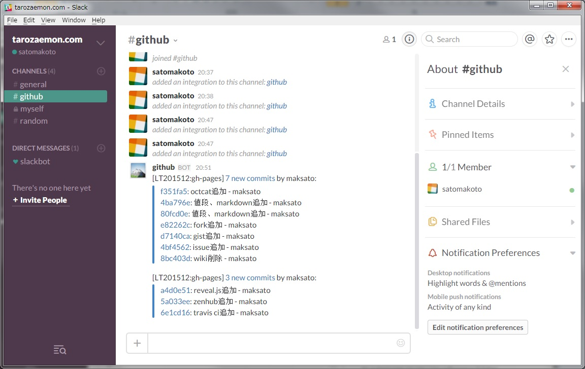

チャットにログが流れる

これらはほんの一例です。

# だからみんなGitHubを使おう

こんなに便利で楽しいGitHub。  
さあ、 Let's social coding!  

<!--
こんなに便利なサービスを使わないんですか？  
プログラマーなら楽をしましょう。  
便利な道具を無視してわざわざ苦労を背負い込むなんてプログラマーじゃないですよ！  
-->

<!-- -->  
<!-- -->  
## といいつつ、実は・・・

残酷なことに、   
**GitHubのアカウントはプログラマーの履歴書になってしまう**  
のです・・・。  
<!-- -->  
GitHubにアカウントを持っていないプログラマーなんて、  
そんなプログラマーはいないんです・・・。  
これからいっぱい使って立派なプログラマーに・・・  
なるんだ・・・ (´・ω・`)  

# 俺たちの戦いはこれからだ！  

## ありがとうございました。  
