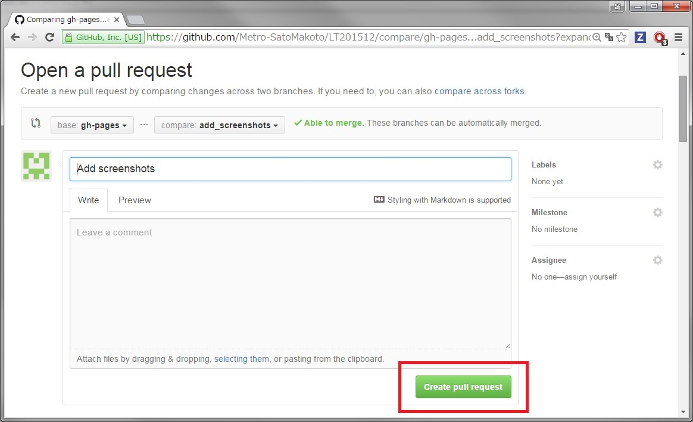
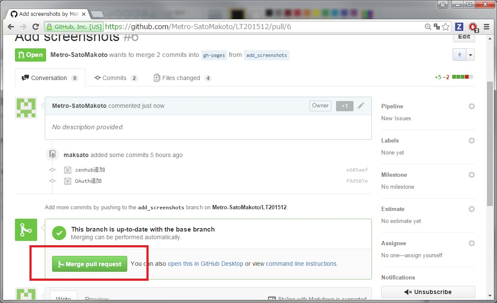

# GitHubを使おう

<!-- -->  
BS企業  
LT201512  
佐藤誠  

# GitHubを使わざればプログラマーに非ず！

# GitHubとは

# こんなサービス

Gitホスティングサービス  
<!-- -->  
特徴的なのは・・・  

## Fork  
Gitリポジトリーのcloneを独自に管理。  

## PullRequest  
GitHub、Social Codingの代名詞。  
  

これを  

  

こうして  

  

マージすると  

取り込める  
(これは自分のリポジトリーなのでサードパーティーのプルリクとは少しちがう)  

## ドキュメントはmarkdown  

これは実は・・・

こう書かれている。  

Visual Studio Codeでレンダリングしつつ書く。
  

## お値段無料  
オープンソースなら無料。  

# こんなに便利

## issue管理
はじめのうちはチケットトラッキングシステム不要。  

## GitHub Pages
プロジェクト紹介、デモページにできる。  

リポジトリーにgh-pagesブランチを作って  

htmlを書くだけ。  
JavaScriptも使える。  
専用ドメインからアクセスしよう。  

# 広大なエコシステム

自前機能だけじゃない、充実のエコシステムも魅力。  

## OAuthを提供
GitHubアカウントでログインできるサービス多数  

## reveal.js  
GitHub Pagesをパワポ風に。  

これが原稿のmarkdownで・・・  

こう見せてくれる。  
今見てますね。  

## ZenHub
issueをカンバン風に表示してくれるChromeアプリ。  

これを・・・  

こう整理できる。  
作業内容が一目瞭然。  

## Travis CI
GitHubでは定番のCIツール。  

このバッジは  

Travis CIのビルド通過のバッジ。  
GitHubにPushすると自動的にビルドしているリポジトリー多数。  

## Slack  
チャットプラットフォーム。  
GitHubの周辺ツールというわけではないのですが・・・  

commitをpushすると  

  

チャットにログが流れる  
Travis CIのビルド結果も流せる。  
複数人開発の味方。  

これらはほんの一例です。

# だからみんなGitHubを使おう

こんなに便利で楽しいGitHub。  
さあ、 Let's social coding!  

<!-- -->  
<!-- -->  
## といいつつ、実は・・・

残酷なことに、   
**GitHubのアカウントはプログラマーの履歴書になってしまう**  
のです・・・。  
<!-- -->  
GitHubにアカウントを持っていないプログラマーなんて、  
そんなプログラマーはいないんです・・・。  
これからいっぱい使って立派なプログラマーに・・・  
なるんだ・・・ (´・ω・`)  

# 俺たちの戦いはこれからだ！  

## ありがとうございました。  
